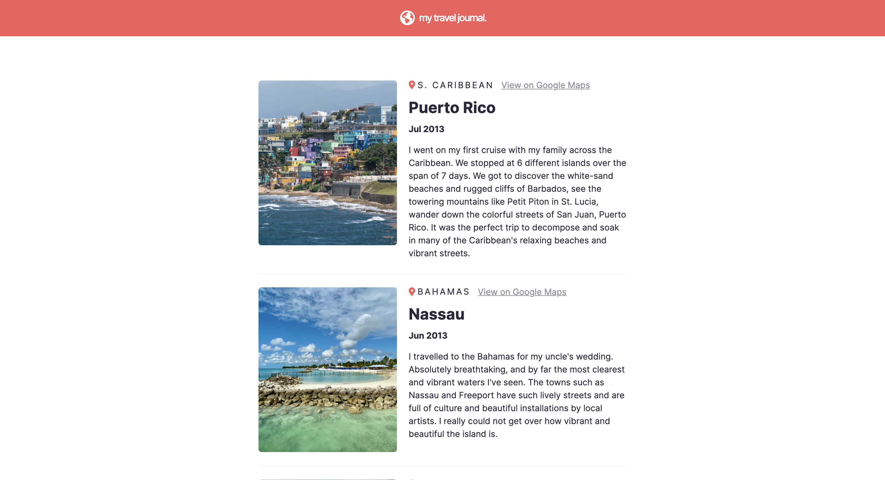

# travel-journal
This travel journal is part of Scrimba's Frontend Career Path's React Section 2 Solo Project. I followed the design file provided on Figma. It is built with Vite + React.

## Demo
[Live Demo](https://neshacascia-travel-journal.netlify.app)

## Built with
- Vite + React
- CSS Flexbox

## Lessons Learned
I learned the importance of creating reusable components. I got to practice mapping over an array of data using array method .map() to render those elements into components. I also got to see how much simpler it is to pass in the entire object which makes accessing the props object easier in my component function.
